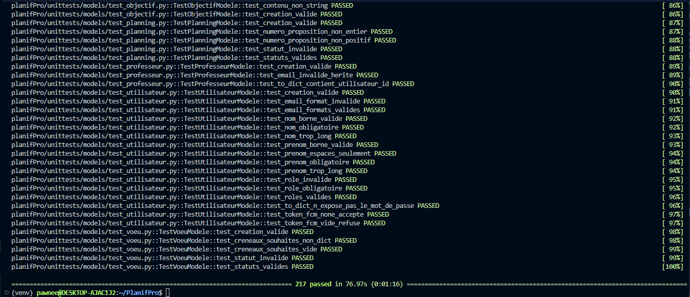

# PlanifPro : Livrables Stage 4

Projet portfolio individuel : Holberton School Bordeaux
Développeuse : Pawnee Defize

Cette page rassemble l'ensemble des livrables demandés pour le Stage 4 (MVP Development & Execution).

---

## Livrables

| Livrable | Lien / Emplacement |
|---|---|
| **Sprint planning** | [GitHub Projects : Roadmap PlanifPro](https://github.com/users/Pawnee33/projects/2/views/2) |
| **Sprint Reviews** | [Google Docs : Sprint Reviews](https://docs.google.com/document/d/1_3C8nWxGPyosWEBdRuBM4uCvyTfjU1cXHybenF8ziWQ/edit?usp=sharing) |
| **Retrospectives** | [Wiki GitHub : PlanifPro](https://github.com/Pawnee33/PlanifPro/wiki) (une rétrospective par sprint, Sprints 1 à 5) |
| **Source repository** | [github.com/Pawnee33/PlanifPro](https://github.com/Pawnee33/PlanifPro) |
| **Bug tracking** | [GitHub Issues]([https://github.com/Pawnee33/PlanifPro/issues](https://github.com/users/Pawnee33/projects/2)) (bugs : #104 à #111) |
| **Testing evidence & results** | Tests unitaires (pytest, 217 tests) + scripts d'API (`tests/`) + tests end to end. Voir ci-dessous. |
| **Production environment** | Front : [planif-pro.vercel.app](https://planif-pro.vercel.app) — Back : [planifpro-back.onrender.com](https://planifpro-back.onrender.com) |

---

## Environnement de production

- **Frontend** (Vercel) : https://planif-pro.vercel.app
- **Backend / API** (Render, Docker) : https://planifpro-back.onrender.com
- **Documentation API (Swagger)** : https://planifpro-back.onrender.com/api/v1/
- **Base de données** : PostgreSQL 16 managée sur Render (accès interne)

> ℹ️ Le backend est hébergé sur le plan gratuit de Render : après une période d'inactivité, la première requête peut prendre ~30 secondes (réveil du service).

---

## Preuves de tests (Testing evidence)

Trois niveaux de tests couvrent l'application :

- **Tests unitaires (pytest)** : 217 tests au vert (modèles + endpoints). Lancer avec :
  ```bash
  pytest -v
  ```
- **Tests d'API / intégration (curl)** : scripts bash dans `tests/`, rejouant les parcours complets (authentification, classes, vœux, planning, créneaux, événements, objectifs).
- **Tests end-to-end** : parcours utilisateur complet vérifié en production (inscription, connexion, génération/validation de planning, import Google Calendar).

- **Capture d'écran des tests unitaires validés**:



---

## Suivi de projet (Agile)

- **Méthode** : développement en sprints hebdomadaires, suivi via GitHub Projects.
- **Gestion des tâches et bugs** : GitHub Issues (une issue par fonctionnalité / par bug).
- **Contrôle de version** : Gitflow (branches `feature/*` et `fix/*` → `develop` → `main`), Conventional Commits en français, Pull Requests systématiques avec template.
